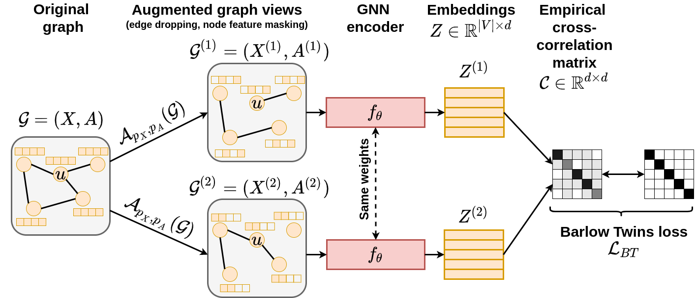

# Graph Barlow Twins
This repository provides the official implementation of the Graph Barlow Twins method. 
It also includes the whole experimental pipeline which is built using DVC.



### How to use?
- create and activate virtual environment (`venv`)
- install dependencies (`pip install -r requirements.txt`)
- *pull all files from the DVC remote (`dvc pull`) 

*The whole pipeline should be reproducible without any external data dependencies. 
If you want to use precomputed stage outputs, please perform the `dvc pull` command
and it will download all stage artifacts into the `data/ssl/` directory. You don't
need any credentials as a public DVC remote endpoint is used in the DVC configuration 
file. The total size of all artifacts is about 100GB.

If you want to use Docker instead of virtual environments, this repo contains also
a ready-to-use Dockerfile:
```bash
docker build -t graph_barlow_twins:latest -f docker/Dockerfile .

# This script assumes that you will use a GPU for computation acceleration. 
./docker/run-docker-gpu.sh "<gpu-id>"  

# If you do not have access to a GPU, use the following script:
./docker/run-docker-cpu.sh
```

## Training & evaluation
We implement all our models using the PyTorch-Geometric library and use DVC 
(Data Version Control) for model versioning. DVC enables to run all experiments 
in a single command and ensure better reproducibility. To reproduce the whole 
pipeline run: `dvc repro` and to execute a single stage use: `dvc repro -f -s <stage name>`

There are following stages:
- `preprocess_dataset@<dataset_name>` - downloads the `<dataset_name>` dataset; if applicable, generates the node splits for train/val/test,
- `hps_transductive_barlow_twins@<dataset_name>`, `hps_transductive_hsic@<dataset_name>` -- runs the augmentation hyperparameter search for a given dataset (in the transductive scenario, i.e. WikiCS, Amazon-CS, Amazon-Photo, Coauthor-CS, Coauthor-Physics, ogbn-arxiv), using the Barlow Twins and Hilbert-Schmidt Independence Criterion loss, respectively,
- `train_transductive_barlow_twins@<dataset_name>`, `train_transductive_hsic@<dataset_name>` -- trains and evaluates the G-BT and G-HSIC model, respectively, for a given dataset (in the transductive scenario),
- `hps_inductive_barlow_twins`, `hps_inductive_hsic` -- runs the augmentation hyperparameter search for the PPI dataset, using the Barlow Twins and Hilbert-Schmidt Independence Criterion loss, respectively,
- `train_inductive_ppi_barlow_twins`, `train_inductive_ppi_hsic` -- trains and evaluates the G-BT and G-HSIC model, respectively, for the PPI dataset.

All hyperparameters described in Appendix A are stored in configuration files in 
the `experiments/configs/` directory, whereas the experimental Python scripts are 
placed in the `experiments/scripts/` directory. 


## Results
We perform three main experiments. We denote Graph Barlow Twins as G-BT and the 
variant with the Hilbert-Schmidt Independence Criterion as G-HSIC.

1. Transductive node classification on small and medium-sized datasets

We use 5 benchmark datasets, namely: WikiCS, Amazon-CS, Amazon-Photo, Coauthor-CS 
and Coauthor-Physics. We report the node classification accuracy after 1 000 epochs.
This is an order of magnitude faster than the current state-of-the-art self-supervised
graph representation learning method [BGRL](https://arxiv.org/pdf/2102.06514.pdf).

|   | WikiCS | Amazon-CS | Amazon-Photo | Coauthor-CS | Coauthor-Physics |
|---|--------|-----------|--------------|-------------|------------------|
Raw features |  71.98 ± 0.00 | 73.81 ±  0.00 | 78.53 ± 0.00 | 90.37 ± 0.00 | 93.58 ± 0.00 |
DeepWalk     |  74.35 ± 0.06 | 85.68 ± 0.06 | 89.44 ± 0.11 | 84.61 ± 0.22 | 91.77 ± 0.15 |
DGI | 75.35 ± 0.14 | 83.95 ± 0.47  | 91.61 ± 0.22 |  92.15 ± 0.63 | 94.51 ± 0.52 |
**G-BT (1k epochs)** | 77.30 ± 0.62 | 88.02 ± 0.32 | 92.23 ± 0.35 | 92.85 ± 0.31 | 95.23 ± 0.11 |
**G-HSIC (1k epochs)** | 76.83 ± 0.73 | 87.93 ± 0.36 | 92.46 ± 0.35 | 92.91 ± 0.25 | 95.25 ± 0.13|
BGRL (10k epochs)  | 79.36 ± 0.53 | 89.68 ± 0.31 | 92.87 ± 0.27 | 93.21 ± 0.18 | 95.56 ± 0.12 |
Supervised GCN | 77.19 ± 0.12 | 86.51 ± 0.54 | 92.42 ± 0.22 | 93.03 ± 0.31 | 95.65 ± 0.16 |

2. Transductive node classification on a larger dataset

We use the ogbn-arxiv dataset from the [Open Graph Benchmark](https://ogb.stanford.edu/) 
and report the node classification accuracy. One model variant converges after 300 epochs
(G-BT) and the other one after 400 epochs (G-HSIC).

|   | Validation | Test |
|---|------------|------|
MLP              | 57.65 ± 0.12 | 55.50 ± 0.23 |
node2vec         | 71.29 ± 0.13 | 70.07 ± 0.13 |
DGI              | 71.26 ± 0.11 | 70.34 ± 0.16 |
GRACE (10k epochs) | 72.61 ± 0.15 | 71.51 ± 0.11 |
BGRL (10k epochs)  | 72.53 ± 0.09 | 71.64 ± 0.12 |
**G-BT (300 epochs)** | 70.95 ± 0.12 | 70.07 ± 0.16 |
**G-HSIC (400 epochs)** | 70.94 ± 0.17 | 70.01 ± 0.17 |
Supervised GCN | 73.00 ± 0.17 | 71.74 ± 0.29 |

3. Inductive node classification

We also check the scenario of inductive learning over multiple graphs using the 
PPI dataset (24 graphs). We report the Micro-F1 score for multilabel node classification
(121 labels).

|   | Test |
|---|------|
Raw features    | 42.20 |
DGI     | 63.80 ± 0.20 |
GRACE GAT encoder (20k epochs) | 69.71 ± 0.17 |
BGRL GAT encoder  (20k epochs) | 70.49 ± 0.05 |
**G-BT (500 epochs)** | 70.61 ± 0.19  |
**G-HSIC (500 epochs)** | 70.15 ± 0.24  |
Supervised MeanPooling  | 96.90 ± 0.20|
Supervised GAT          | 97.30 ± 0.20|


## Reference
If you make use Graph Barlow Twins in your research, please cite it using the following entry:

```
@misc{bielak2021graph,
      title={Graph Barlow Twins: A self-supervised representation learning framework for graphs}, 
      author={Piotr Bielak and Tomasz Kajdanowicz and Nitesh V. Chawla},
      year={2021},
      eprint={2106.02466},
      archivePrefix={arXiv},
      primaryClass={cs.LG}
}
```

## License
MIT

